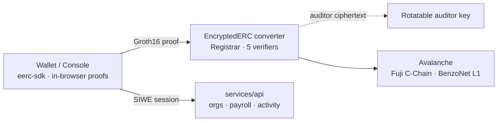
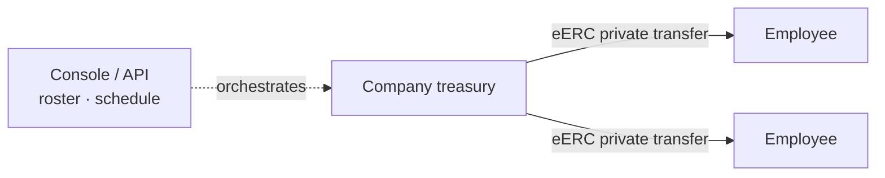
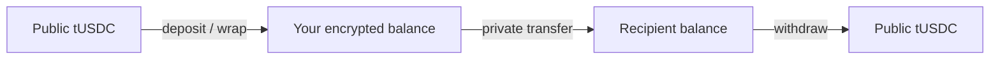
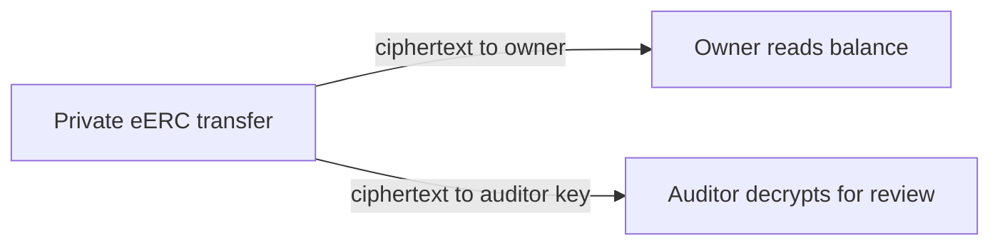
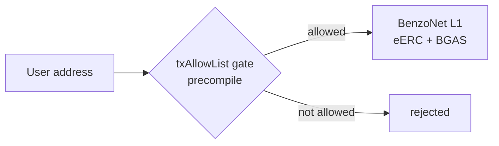
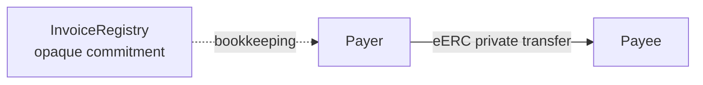
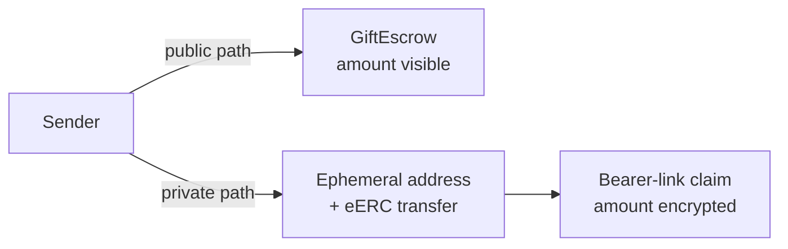

<p align="center">
  
</p>

<p align="center">
  <a href="https://github.com/Miny-Labs/benzo/actions/workflows/ci.yml">
    
  </a>
</p>

<p align="center">
  <strong>Private USDC-style payments on Avalanche.</strong><br />
  Shield a public ERC-20 into an encrypted eERC balance, send it privately,
  and keep a rotatable auditor key for controlled review.
</p>

## Provenance & Delta

Benzo v1 shipped on Stellar/Soroban: 16 Soroban contracts, 16 Groth16
circuits, a wallet, and a business console. That version is preserved at the
[`stellar-final`](https://github.com/Miny-Labs/benzo/tree/stellar-final) tag,
which points to commit
[`fbb4d4e`](https://github.com/Miny-Labs/benzo/commit/fbb4d4e).

This Avalanche version is a ground-up rebuild. The contracts stack is new and
is based on [`ava-labs/EncryptedERC`](https://github.com/ava-labs/EncryptedERC)
v0.0.4, Groth16/Circom proofs, and ElGamal encryption over BabyJubJub. The
apps, service layer, deployment scripts, and permissioned L1 infrastructure are
new for Avalanche.

Zero code is shared with the Stellar implementation. Only the Benzo name and
the product thesis carry over.

## What Benzo Does

Benzo is a private payments system for stablecoin workflows. Users register an
eERC key, deposit a public ERC-20 into the converter, and then send encrypted
balances on-chain. Groth16 proofs enforce balance correctness while transfer
amounts and balances stay encrypted. A designated auditor public key receives a
separate decryptable ciphertext for compliance review.

Privacy in this README means privacy enforced by on-chain proofs and
encryption. Benzo does not claim to hide addresses, timestamps, gas payments,
or product workflow metadata unless a section says so explicitly.

## Architecture



The wallet and console use `@avalabs/eerc-sdk` with wagmi/viem, snarkjs, and
served circuit files (`.wasm` and `.zkey`) to produce proofs in the browser.
Those proofs settle against the `Registrar`, `EncryptedERC`, and five Groth16
verifier contracts. Every private operation also carries an auditor ciphertext
encrypted to the current auditor public key. The `services/api` layer holds
session, org, and workflow state; it never sees decrypted balances.

BenzoNet is the permissioned deployment path: an Evergreen-style institutional
L1 with PoA validator control, `txAllowList` as the KYC gate, a valueless gas
token (`BGAS`), and `validatorOnly` read privacy. Benzo deliberately stops
there; no extra institutional machinery is added just to chase the label.

## The Six Flows

### 1. Private Payroll

A company funds a treasury, registers employees, and sends payroll through
eERC private transfers. The proof system protects payroll amounts on-chain;
the payroll schedule, roster, and approval state are workflow data that belong
in the console/API layer.



### 2. Shielded Stablecoin Transfers

A user deposits a public test ERC-20 such as `tUSDC`, receives an encrypted
balance, and sends privately to another registered user. The receiver decrypts
locally and can later withdraw back to a public ERC-20 balance.



### 3. Auditor-Ready Treasury

An organization can operate with encrypted treasury balances while still
keeping an auditor path. The on-chain contract is configured with a current
auditor public key; the demo key is operator-controlled in this repo, not an
independent custodian.



### 4. KYC-Gated Chain (Stretch)

BenzoNet is the permissioned-chain path for institutions that need both eERC
amount privacy and chain access control. The current service includes mock KYC
workflow state; a real provider integration is outside this repo state.



### 5. Confidential B2B Settlement

Invoices can be represented by opaque commitments while the settlement itself
uses an eERC private transfer. The commitment registry is bookkeeping: it does
not prove that a specific transfer paid a specific invoice.



### 6. Private Gifting

Gift links have two tiers. The public escrow contract is simple and visible on
chain. The private bearer-link path uses an ephemeral registered address and an
eERC private transfer, so the amount is encrypted but the link is a bearer
secret.



## What Is Real vs. Simulated

| Area | Real today | Boundary to keep honest |
| --- | --- | --- |
| Fuji eERC stack | `EncryptedERC`, `Registrar`, five verifiers, `BabyJubJub`, and `TestUSDC` are deployed on Fuji and source-verified. | Fuji testnet only; this is not a mainnet deployment. |
| BenzoNet L1 (the bonus combo) | The same eERC stack is deployed and source-verified on the BenzoNet L1 (`68420`). A **real confidential eERC transfer runs on it** (deposit + private transfer, decrypt-verified) and the **tx-allowlist precompile gates every transaction** — a funded non-member is rejected on-chain. So encrypted amounts move *inside* a gated chain. Public RPC `rpc.benzo.space`, explorer [explorer.benzo.space](https://explorer.benzo.space). See [Live proof on BenzoNet](#deployed-on-benzonet-l1--the-bonus-combo-proven). | `validatorOnly` read-restriction is intentionally left OFF so the demo stays publicly verifiable; a production institutional deployment enables it. BenzoNet is a single-validator PoA chain. |
| Stablecoin asset | The checked-in Fuji deployment wraps `TestUSDC` (`tUSDC`), a 6-decimal test token with a faucet. | It is not real USDC. Circle testnet USDC can be used when configured, but the committed deployment manifest points at `tUSDC`. |
| Privacy | Groth16 verifiers and BabyJubJub encryption enforce encrypted balances and transfer amounts on-chain. | Addresses, timing, token approvals, gas funding, and workflow labels are still public or off-chain metadata. |
| Proving setup | Circuits compile locally with `@solarity/hardhat-zkit`; generated `.wasm` and `.zkey` files are integrity-checked. | Generated proving artifacts are ignored and must not be committed. The local setup is acceptable for demos, not a production ceremony. |
| Auditor | The Fuji contract has an auditor public key set and registered. | The auditor is a demo key controlled by the operator, not an independent audit firm or custody system. |
| Wallet and console | The mobile-first wallet and desktop-first console are ported to the Avalanche/eERC stack and live in their own repos: [`Miny-Labs/benzo-wallet`](https://github.com/Miny-Labs/benzo-wallet) and [`Miny-Labs/benzo-console`](https://github.com/Miny-Labs/benzo-console). | This repository is backend + infrastructure only; it has no `apps/` workspace. |
| API service | `services/api` has Fastify, Postgres, SIWE sessions, onboarding, activity indexing, orgs, contacts, handles, and invite metadata. | KYC is mock-only. Workflow data is not payment privacy. |
| Payroll | Org treasury custody and roles are modeled in the API. | Server-side payroll proving and production custody controls are follow-up work. |
| B2B invoices | `InvoiceRegistry` stores commitment-only invoices and payee attestations. | It does not verify payment amount, token, or that an eERC transfer belongs to an invoice. |
| Gift links | `GiftEscrow` is tested for public-token gifts; the private bearer-link path is exercised by script. | Public escrow reveals amount/sender/timing. Private bearer links have no on-chain expiry or refund enforcement. |

## Deployed on Fuji

The eERC converter stack is deployed on Avalanche Fuji C-Chain (`43113`). Full
deployment metadata lives in
[`contracts/deployments/fuji.json`](contracts/deployments/fuji.json). The same
stack is also deployed on the BenzoNet L1
([`contracts/deployments/benzonet.json`](contracts/deployments/benzonet.json))
and verified on [explorer.benzo.space](https://explorer.benzo.space).

| Contract | Address (Fuji) |
| --- | --- |
| `EncryptedERC` converter | [`0x46688f1704a69a6c276cCCB823E36C80787B0FA2`](https://testnet.snowtrace.io/address/0x46688f1704a69a6c276cCCB823E36C80787B0FA2) |
| `Registrar` | [`0x9a63FEa9851097DBAf3757b636217fdde50ABaF0`](https://testnet.snowtrace.io/address/0x9a63FEa9851097DBAf3757b636217fdde50ABaF0) |
| `TestUSDC` (`tUSDC`) | [`0x1226C73Bd8022080b8DbCDC24AA8B61D659A835f`](https://testnet.snowtrace.io/address/0x1226C73Bd8022080b8DbCDC24AA8B61D659A835f) |
| `BabyJubJub` library | [`0xa1d0f50D5f479a2aeC3C67A38a6fa5c735CcC313`](https://testnet.snowtrace.io/address/0xa1d0f50D5f479a2aeC3C67A38a6fa5c735CcC313) |
| Registration verifier | [`0x4250bD1eb89Ef78469f94da2fE7738DCdcb09Ef7`](https://testnet.snowtrace.io/address/0x4250bD1eb89Ef78469f94da2fE7738DCdcb09Ef7) |
| Mint verifier | [`0x0fE395F5E97Ee02c961DE3d035E5De2D9019D15E`](https://testnet.snowtrace.io/address/0x0fE395F5E97Ee02c961DE3d035E5De2D9019D15E) |
| Transfer verifier | [`0x4bF3DBD3fF57943dC402ec1F280589E1032A32A5`](https://testnet.snowtrace.io/address/0x4bF3DBD3fF57943dC402ec1F280589E1032A32A5) |
| Withdraw verifier | [`0x7E194cb8A575d23f74EEDbEf1b519B281B29c30e`](https://testnet.snowtrace.io/address/0x7E194cb8A575d23f74EEDbEf1b519B281B29c30e) |
| Burn verifier | [`0x1BDfD6cB772D5F882622BaFD7B19898Da9F61d34`](https://testnet.snowtrace.io/address/0x1BDfD6cB772D5F882622BaFD7B19898Da9F61d34) |

The auditor account recorded in the deployment manifest is
`0xa0C5455eF9A7D71e9B5b3ce8Cf3C7E06D856bEDB`. Its BabyJubJub private key is a
local operator secret and must never be committed.

## Deployed on BenzoNet L1 — the bonus combo, proven

BenzoNet is Benzo's own permissioned Avalanche L1 (Subnet-EVM, chain id `68420`,
gas token BGAS). The **same eERC converter stack** is deployed and source-verified
on it, so encrypted eERC amounts move **inside** a gated chain — the Speedrun's
explicit bonus (encrypted amounts *and* gated access at once). Public RPC:
`https://rpc.benzo.space` · explorer: [explorer.benzo.space](https://explorer.benzo.space)
· full manifest: [`contracts/deployments/benzonet.json`](contracts/deployments/benzonet.json).

| Contract | Address (BenzoNet `68420`) |
| --- | --- |
| `EncryptedERC` converter | [`0x790Dd53099E5009a9Cf572769a5A663cCb7EfAcE`](https://explorer.benzo.space/address/0x790Dd53099E5009a9Cf572769a5A663cCb7EfAcE) |
| `Registrar` | [`0xdfB9b7d958539FC4A1e31C9b813833Fb972B30Ff`](https://explorer.benzo.space/address/0xdfB9b7d958539FC4A1e31C9b813833Fb972B30Ff) |
| `TestUSDC` (`tUSDC`) | [`0x85546bE3564d503F6ED77a4DA44BEF32EcAEd034`](https://explorer.benzo.space/address/0x85546bE3564d503F6ED77a4DA44BEF32EcAEd034) |
| `BabyJubJub` library | [`0x542251F24101841485f7d3CD312955b254c7717D`](https://explorer.benzo.space/address/0x542251F24101841485f7d3CD312955b254c7717D) |
| tx-allowlist precompile | `0x0200000000000000000000000000000000000002` |

**Live proof (reproducible on the public RPC):**

1. **Confidential transfer** — a private eERC transfer of 30 tUSDC with the amount
   encrypted on-chain (Groth16), decrypt-verified sender `70` / receiver `30`:
   - deposit → [`0xa38bf2889dd88d112a8bb851da37010ac463a070ba801bb01608b1a9b6f7775b`](https://explorer.benzo.space/tx/0xa38bf2889dd88d112a8bb851da37010ac463a070ba801bb01608b1a9b6f7775b)
   - private transfer → [`0x5d480780e8ebd69d8ef80a5eb2d46a656efc19579bfd312c400056dfb929669c`](https://explorer.benzo.space/tx/0x5d480780e8ebd69d8ef80a5eb2d46a656efc19579bfd312c400056dfb929669c)
   - Reproduce: `PRIVATE_KEY=<deployer> PRIVATE_KEY_2=<ops> BENZONET_RPC_URL=https://rpc.benzo.space npx hardhat run scripts/deploy/benzonet-confidential-demo.ts --network benzonet`
2. **Gated access** — a funded but non-allow-listed wallet is rejected at the
   tx-allowlist precompile before its tx reaches a block (*"cannot issue
   transaction from non-allow listed address"*). Only an Admin/Manager
   (`benzo-ops`) can Enable a wallet — the gated-onboarding step.
   - Reproduce: `PRIVATE_KEY=<deployer> BENZONET_RPC_URL=https://rpc.benzo.space npx hardhat run scripts/deploy/benzonet-gated-access-demo.ts --network benzonet`

Together these are the two privacy primitives stacked on one chain: eERC hides the
*amounts*, the permissioned L1 walls off *who can transact* — encrypted value
moving inside a gated, auditor-ready chain.

## Mainnet Readiness

Benzo is **mainnet-ready, not mainnet-deployed** — a deliberate, paused gate. The
codebase is wired for the Avalanche C-Chain (`43114`) and the whole path is proven
on Fuji, but **nothing broadcasts to mainnet**. Going live is mostly a config flip;
the one genuinely hard, unstarted step is the production trusted setup. Mainnet is
**C-Chain converter only** — BenzoNet stays testnet-only and is excluded from
mainnet. Full checklist: [`docs/MAINNET_GO_NO_GO.md`](docs/MAINNET_GO_NO_GO.md).

**The split: what is config vs. what is new work.**

| Category | What changes | Status |
| --- | --- | --- |
| **Pure config** | RPC `https://api.avax.network/ext/bc/C/rpc`, explorer `snowtrace.io`, chainId `43114`; CCTP domain unchanged (Avalanche = `1`); attestation base sandbox → prod (`iris-api.circle.com`); separate prod secrets (`APP_MASTER_KEY`, `OPS_PRIVATE_KEY`, deployer, auditor, `DATABASE_URL`). | Wired; flip at cutover |
| **New code (already shipped on testnet)** | Token-agnostic per-network deploy, the `avalanche` network wiring, and the guard-railed `deploy:mainnet` command. | Done — this milestone |
| **New crypto (the hard part)** | A real multi-operator Groth16 phase-2 ceremony to replace the dev (`contributions:0`) verifiers. | **Not done — required before any mainnet deploy** |

**Exact mainnet addresses (Circle / CCTP V2, verified on-chain).**

| Thing | Address (Avalanche C-Chain `43114`) |
| --- | --- |
| USDC | `0xB97EF9Ef8734C71904D8002F8b6Bc66Dd9c48a6E` |
| EURC | `0xC891EB4cbdEFf6e073e859e987815Ed1505c2ACD` |
| CCTP `TokenMessengerV2` | `0x28b5a0e9C621a5BadaA536219b3a228C8168cf5d` |
| CCTP `MessageTransmitterV2` | `0x81D40F21F12A8F0E3252Bccb954D722d4c464B64` |

The mainnet converter wraps **real Circle USDC** (never a `TestUSDC`), pinned to
`tokenId 1`. `pnpm --filter @benzo/contracts deploy:mainnet` refuses to send a
single transaction unless every guardrail passes (confirm flag, chainId `43114`,
existing-USDC wrapping, a **ceremony** verifier build, distinct deployer/auditor
keys, a funded deployer, and an operator-provided auditor key).

**The honest hard parts.**

- **Production trusted setup.** Today's verifiers come from a dev setup
  (`hardhat.config.ts` → `contributionSettings.contributions: 0`) and back Fuji
  only. A real ceremony (`scripts/ceremony/run-ceremony.ts` + a public beacon +
  published transcript) must regenerate them; the committed ceremony marker keeps
  `deploy:mainnet` from ever accepting the dev build. Multi-operator coordination
  is real work that has not been done.
- **eERC deposit-on-behalf behind CCTP one-tap.** The one-tap cross-chain deposit
  relies on the router depositing into the converter on the user's behalf; that
  patch is proven on testnet and carries forward unchanged, but it is a real code
  path, not a config value.
- **W3 is reveal-and-verify, not a ZK disclosure circuit.** Selective disclosure /
  proof-of-payment reveals the underlying values and verifies them; it is **not** a
  zero-knowledge disclosure proof. That limitation is intentional and stated
  plainly rather than dressed up.

## Repository Layout

This repository holds the Benzo backend and infrastructure. The end-user apps
live in their own repositories.

```text
contracts/       Hardhat workspace: eERC, verifiers, Benzo registries, Fuji manifests
services/api/    Fastify + Postgres service for auth, onboarding, activity, org workflows
infra/           BenzoNet genesis, deployed L1 metadata, edge/Caddy topology, smoke tests
packages/config/ Shared chain defs, deployed addresses, and circuit URL helpers
assets/readme/   README banner and brand marks
```

| App | Repository |
| --- | --- |
| Consumer wallet (mobile-first) | [`Miny-Labs/benzo-wallet`](https://github.com/Miny-Labs/benzo-wallet) |
| Business console (desktop-first) | [`Miny-Labs/benzo-console`](https://github.com/Miny-Labs/benzo-console) |
| BenzoNet block explorer | [`Miny-Labs/benzo-explorer`](https://github.com/Miny-Labs/benzo-explorer) |

## Five-Minute Quickstart

Prerequisites: Node.js 22+, pnpm, and Docker for the API test suite.

```bash
pnpm install && pnpm compile && pnpm --filter @benzo/contracts zkit:make && pnpm test
```

That installs the workspace, compiles the contracts, generates ignored local
zkit artifacts for the proof-heavy contract tests, and runs the test suites.
After `contracts/zkit/` exists locally, the shorter loop is:

```bash
pnpm install && pnpm compile && pnpm test
```

No Fuji private key is needed for the quickstart. Deployment and smoke commands
that touch Fuji or BenzoNet require operator-held keys and are documented in
[`contracts/README.md`](contracts/README.md) and
[`infra/README.md`](infra/README.md).

## Testing

Three tiers, all config-driven off `@benzo/config` so mainnet is a manifest swap:

- **Unit / default** — `pnpm test`. Fundless, no network; the Fuji-fork and funded
  tiers self-skip here so this stays fast and green.
- **TIER 1 — Fuji-fork integration** (`.github/workflows/fuji-fork.yml`, runs on
  every PR + push). `FORK=fuji pnpm --filter @benzo/contracts test` forks Fuji at
  a pinned block and exercises `BenzoCCTPRouter` against **real** Circle USDC +
  the real CCTP `TokenMessenger` bytecode (happy path, fee-shortfall, duplicate
  message, unregistered recipient). Fundless — no secrets, no keys.
- **TIER 2 — funded live-testnet e2e** (`tests/e2e`, `@benzo/e2e`;
  `.github/workflows/e2e-live.yml`, nightly + manual, **not** a required check).
  Real testnet funds. Every suite self-skips unless `RUN_LIVE_E2E=1` and its
  funded accounts (`BENZO_ONRAMP_USER_KEY` / `BENZO_RELAYER_KEY` / …) are present
  and funded — a missing/underfunded account turns into a precise `Fund 0x… on
  fuji …` skip, never a failure. Suites: `eerc-core`, `cctp-onramp`, `disclosure`,
  `payroll-batch`, `auditor-rotate`, `benzonet-gating`. A concurrency group
  serializes runs so they never race the relayer nonce. Run locally with
  `RUN_LIVE_E2E=1 pnpm --filter @benzo/e2e test`.

No address is ever hard-coded in a test body — everything resolves from the
`@benzo/config` deployment manifest, so pointing a tier at mainnet is a config
change, not a code change. See `.env.example` for the testnet-only variables.

## License

Benzo is Apache-2.0. The vendored
[`ava-labs/EncryptedERC`](contracts/contracts/eerc/VENDOR.md) code keeps its
upstream attribution and is licensed under the Ava Labs Ecosystem License v1.1;
its use is limited to Avalanche platforms and non-commercial testing/research
inside the Avalanche ecosystem.
