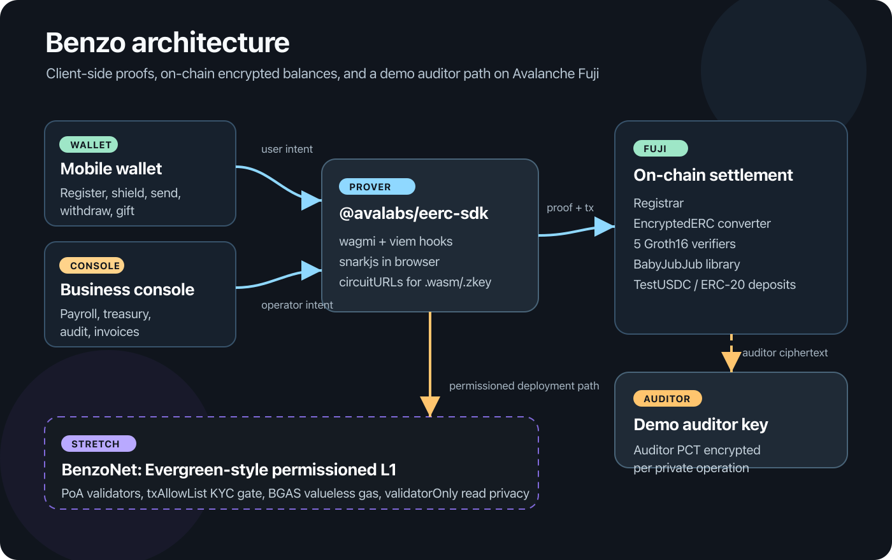
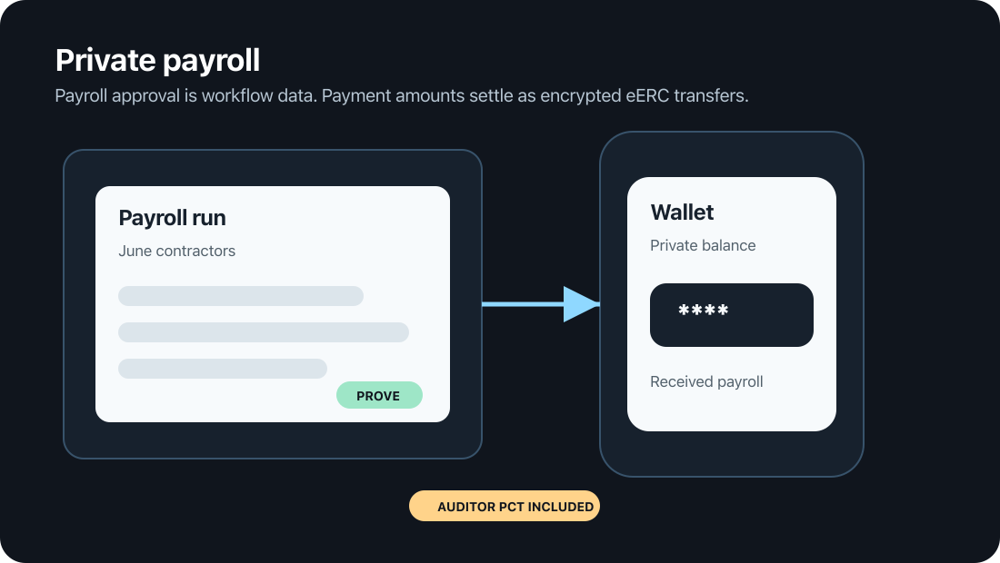
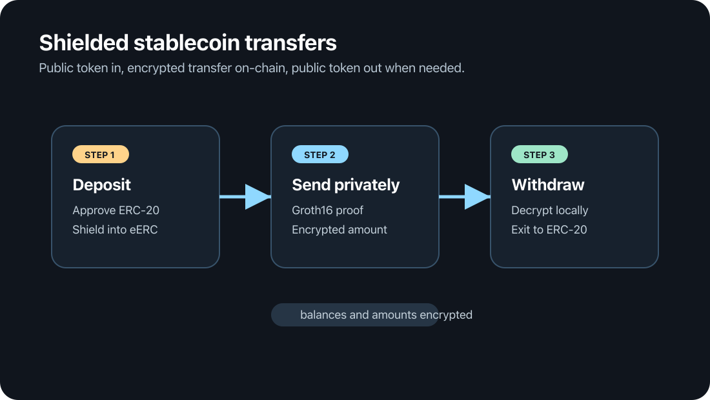
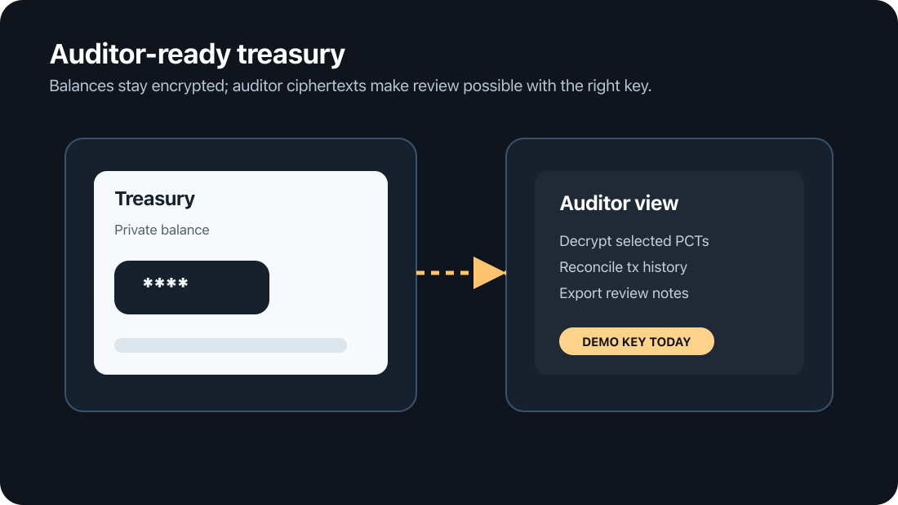
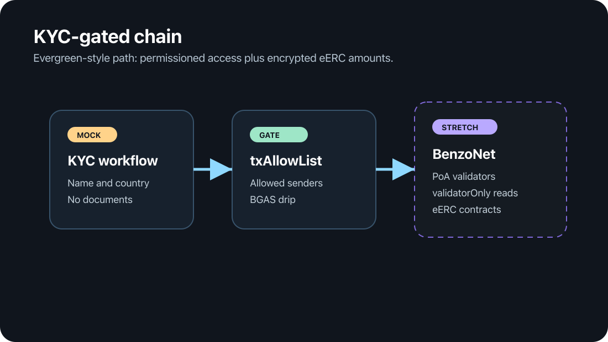
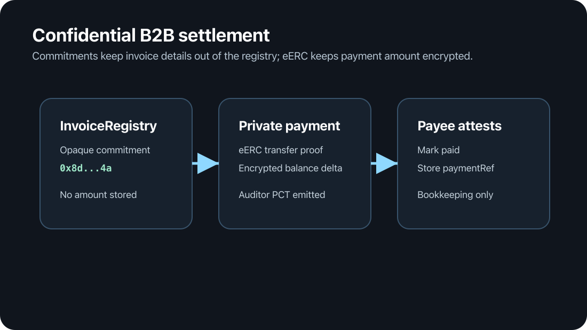
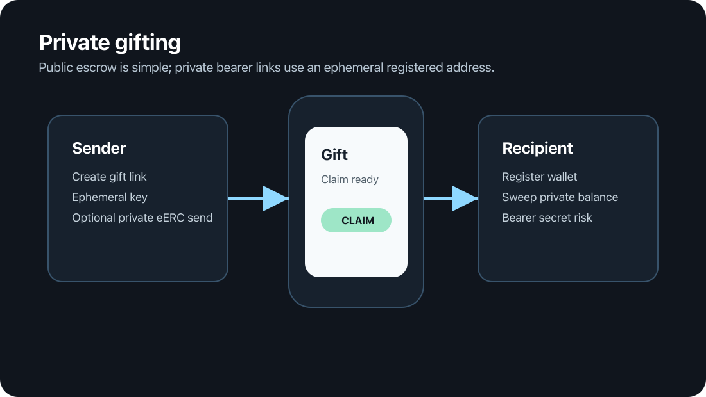

<p align="center">
  
</p>

<p align="center">
  <a href="https://github.com/Miny-Labs/benzo/actions/workflows/ci.yml">
    
  </a>
</p>

<p align="center">
  <strong>Private USDC-style payments on Avalanche.</strong><br />
  Shield a public ERC-20 into an encrypted eERC balance, send it privately,
  and keep a rotatable auditor key for controlled review.
</p>

## Provenance & Delta

Benzo v1 shipped on Stellar/Soroban: 16 Soroban contracts, 16 Groth16
circuits, a wallet, and a business console. That version is preserved at the
[`stellar-final`](https://github.com/Miny-Labs/benzo/tree/stellar-final) tag,
which points to commit
[`fbb4d4e`](https://github.com/Miny-Labs/benzo/commit/fbb4d4e).

This Avalanche version is a ground-up rebuild. The contracts stack is new and
is based on [`ava-labs/EncryptedERC`](https://github.com/ava-labs/EncryptedERC)
v0.0.4, Groth16/Circom proofs, and ElGamal encryption over BabyJubJub. The
apps, service layer, deployment scripts, and permissioned L1 infrastructure are
new for Avalanche.

Zero code is shared with the Stellar implementation. Only the Benzo name and
the product thesis carry over.

## What Benzo Does

Benzo is a private payments system for stablecoin workflows. Users register an
eERC key, deposit a public ERC-20 into the converter, and then send encrypted
balances on-chain. Groth16 proofs enforce balance correctness while transfer
amounts and balances stay encrypted. A designated auditor public key receives a
separate decryptable ciphertext for compliance review.

Privacy in this README means privacy enforced by on-chain proofs and
encryption. Benzo does not claim to hide addresses, timestamps, gas payments,
or product workflow metadata unless a section says so explicitly.

## Architecture



Source: [`assets/readme/benzo-architecture.svg`](assets/readme/benzo-architecture.svg)

In the target product architecture, the wallet and console use
`@avalabs/eerc-sdk` with wagmi/viem, snarkjs, and served circuit files
(`.wasm` and `.zkey`) to produce proofs in the browser. Those proofs settle
against the Fuji contracts: `Registrar`, `EncryptedERC`, and the five Groth16
verifier contracts. The auditor path is part of the contract design: private
operations include auditor ciphertext encrypted to the current auditor public
key.

BenzoNet is marked as stretch in the diagram because it is infrastructure for
the permissioned deployment path. It is an Evergreen-style institutional
permissioned L1: PoA validator control, `txAllowList` as the KYC gate, a
custom valueless gas token (`BGAS`), and `validatorOnly` read privacy. Benzo
deliberately stops there; no extra institutional machinery is added just to
chase the label.

## The Six Flows

### 1. Private Payroll

A company funds a treasury, registers employees, and sends payroll through
eERC private transfers. The proof system protects payroll amounts on-chain;
the payroll schedule, roster, and approval state are workflow data that belong
in the console/API layer.



### 2. Shielded Stablecoin Transfers

A user deposits a public test ERC-20 such as `tUSDC`, receives an encrypted
balance, and sends privately to another registered user. The receiver decrypts
locally and can later withdraw back to a public ERC-20 balance.



### 3. Auditor-Ready Treasury

An organization can operate with encrypted treasury balances while still
keeping an auditor path. The on-chain contract is configured with a current
auditor public key; the demo key is operator-controlled in this repo, not an
independent custodian.



### 4. KYC-Gated Chain (Stretch)

BenzoNet is the permissioned-chain path for institutions that need both eERC
amount privacy and chain access control. The current service includes mock KYC
workflow state; a real provider integration is outside this repo state.



### 5. Confidential B2B Settlement

Invoices can be represented by opaque commitments while the settlement itself
uses eERC private transfer. The commitment registry is bookkeeping: it does not
prove that a specific transfer paid a specific invoice.



### 6. Private Gifting

Gift links have two tiers. The public escrow contract is simple and visible on
chain. The private bearer-link path uses an ephemeral registered address and an
eERC private transfer, so the amount is encrypted but the link is a bearer
secret.



## What Is Real vs. Simulated

| Area | Real today | Boundary to keep honest |
| --- | --- | --- |
| Fuji eERC stack | `EncryptedERC`, `Registrar`, five verifiers, `BabyJubJub`, and `TestUSDC` are deployed on Fuji and source-verified. | Fuji testnet only; this is not a mainnet deployment. |
| Stablecoin asset | The checked-in Fuji deployment wraps `TestUSDC` (`tUSDC`), a 6-decimal test token with a faucet. | It is not real USDC. Circle testnet USDC can be used when configured, but the committed deployment manifest points at `tUSDC`. |
| Privacy | Groth16 verifiers and BabyJubJub encryption enforce encrypted balances and transfer amounts on-chain. | Addresses, timing, token approvals, gas funding, and workflow labels are still public or off-chain metadata. |
| Proving setup | Circuits compile locally with `@solarity/hardhat-zkit`; generated `.wasm` and `.zkey` files are integrity-checked. | Generated proving artifacts are ignored and must not be committed. The local setup is acceptable for demos, not a production ceremony. |
| Auditor | The Fuji contract has an auditor public key set and registered. | The auditor is a demo key controlled by the operator, not an independent audit firm or custody system. |
| Wallet and console | The architecture targets a mobile-first wallet and desktop-first console using `@avalabs/eerc-sdk`. | This branch does not contain an `apps/` workspace. The six images above are README workflow panels, not captured live app screenshots. |
| API service | `services/api` has Fastify, Postgres, SIWE sessions, onboarding, activity indexing, orgs, contacts, handles, and invite metadata. | KYC is mock-only. Workflow data is not payment privacy. |
| Payroll | Org treasury custody and roles are modeled in the API. | Server-side payroll proving and production custody controls are follow-up work. |
| B2B invoices | `InvoiceRegistry` stores commitment-only invoices and payee attestations. | It does not verify payment amount, token, or that an eERC transfer belongs to an invoice. |
| Gift links | `GiftEscrow` is tested for public-token gifts; the private bearer-link path is exercised by script. | Public escrow reveals amount/sender/timing. Private bearer links have no on-chain expiry or refund enforcement. |
| BenzoNet | BenzoNet is deployed as a sovereign Avalanche L1 on Fuji with allowlist precompiles and BGAS. | Public RPC bring-up does not enable `validatorOnly` read privacy; the Evergreen pattern remains the stretch path. |

## Deployed on Fuji

The eERC converter stack is deployed on Avalanche Fuji C-Chain (`43113`). Full
deployment metadata lives in
[`contracts/deployments/fuji.json`](contracts/deployments/fuji.json).

| Contract | Address |
| --- | --- |
| `EncryptedERC` converter | [`0x46688f1704a69a6c276cCCB823E36C80787B0FA2`](https://testnet.snowtrace.io/address/0x46688f1704a69a6c276cCCB823E36C80787B0FA2) |
| `Registrar` | [`0x9a63FEa9851097DBAf3757b636217fdde50ABaF0`](https://testnet.snowtrace.io/address/0x9a63FEa9851097DBAf3757b636217fdde50ABaF0) |
| `TestUSDC` (`tUSDC`) | [`0x1226C73Bd8022080b8DbCDC24AA8B61D659A835f`](https://testnet.snowtrace.io/address/0x1226C73Bd8022080b8DbCDC24AA8B61D659A835f) |
| `BabyJubJub` library | [`0xa1d0f50D5f479a2aeC3C67A38a6fa5c735CcC313`](https://testnet.snowtrace.io/address/0xa1d0f50D5f479a2aeC3C67A38a6fa5c735CcC313) |
| Registration verifier | [`0x4250bD1eb89Ef78469f94da2fE7738DCdcb09Ef7`](https://testnet.snowtrace.io/address/0x4250bD1eb89Ef78469f94da2fE7738DCdcb09Ef7) |
| Mint verifier | [`0x0fE395F5E97Ee02c961DE3d035E5De2D9019D15E`](https://testnet.snowtrace.io/address/0x0fE395F5E97Ee02c961DE3d035E5De2D9019D15E) |
| Transfer verifier | [`0x4bF3DBD3fF57943dC402ec1F280589E1032A32A5`](https://testnet.snowtrace.io/address/0x4bF3DBD3fF57943dC402ec1F280589E1032A32A5) |
| Withdraw verifier | [`0x7E194cb8A575d23f74EEDbEf1b519B281B29c30e`](https://testnet.snowtrace.io/address/0x7E194cb8A575d23f74EEDbEf1b519B281B29c30e) |
| Burn verifier | [`0x1BDfD6cB772D5F882622BaFD7B19898Da9F61d34`](https://testnet.snowtrace.io/address/0x1BDfD6cB772D5F882622BaFD7B19898Da9F61d34) |

The auditor account recorded in the deployment manifest is
`0xa0C5455eF9A7D71e9B5b3ce8Cf3C7E06D856bEDB`. Its BabyJubJub private key is a
local operator secret and must never be committed.

## Repository Layout

```text
contracts/       Hardhat workspace: eERC, verifiers, Benzo registries, Fuji manifests
services/api/    Fastify + Postgres service for auth, onboarding, activity, org workflows
infra/           BenzoNet genesis, deployed L1 metadata, and smoke tests
packages/config/ Shared circuit URL and manifest helpers
assets/readme/   README images and editable diagram sources
apps/            Workspace slot for wallet and console apps; no app is checked in here yet
```

## Five-Minute Quickstart

Prerequisites: Node.js 22+, pnpm, and Docker for the API test suite.

```bash
pnpm install && pnpm compile && pnpm --filter @benzo/contracts zkit:make && pnpm test
```

That installs the workspace, compiles the contracts, generates ignored local
zkit artifacts for the proof-heavy contract tests, and runs the test suites.
After `contracts/zkit/` exists locally, the shorter loop is:

```bash
pnpm install && pnpm compile && pnpm test
```

No Fuji private key is needed for the quickstart. Deployment and smoke commands
that touch Fuji or BenzoNet require operator-held keys and are documented in
[`contracts/README.md`](contracts/README.md) and
[`infra/README.md`](infra/README.md).

## License

Benzo is Apache-2.0. The vendored
[`ava-labs/EncryptedERC`](contracts/contracts/eerc/VENDOR.md) code keeps its
upstream attribution and is licensed under the Ava Labs Ecosystem License v1.1;
its use is limited to Avalanche platforms and non-commercial testing/research
inside the Avalanche ecosystem.
